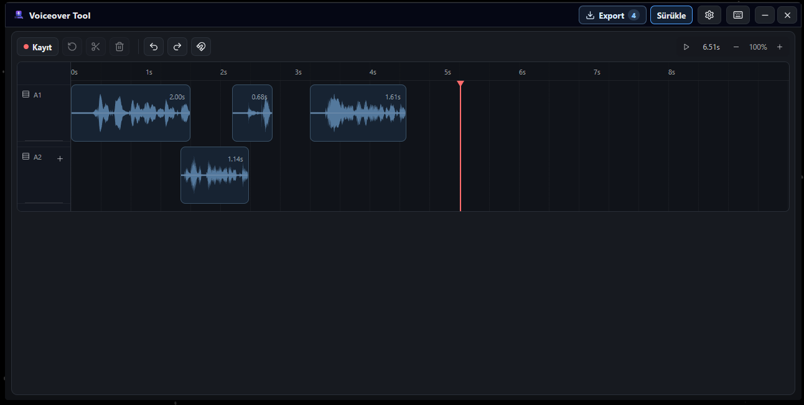

# Voiceover Tool

RNNoise destekli, sade ve hızlı voiceover kayıt uygulaması. Video editörlerdeki karmaşık ses kayıt akışına girmeden temiz ses almayı, parçaları timeline üzerinde düzenlemeyi ve direkt dışa aktarmayı sağlar.



## Ne İşe Yarar?

- Mikrofon kaydını RNNoise ile daha temiz hale getirir.
- Kayıtları parça parça timeline üzerinde gösterir.
- Ses dalgası üzerinden kırpma, bölme, taşıma ve çoklu seçim yapmayı sağlar.
- Snap, zoom, undo/redo ve klavye kısayolları ile hızlı düzenleme sunar.
- Seçili klibi veya tüm timeline seslerini export için hazırlar.
- Export sonrası dosya aramak yerine seçili parçayı veya tüm kaydı direkt sürükle-bırak ile video editör timeline'ına atmayı sağlar.
- Geçmiş kayıt önbelleğini tek tuşla temizler.

## Kullanım

- `F9`: kaydı başlatır veya bitirir.
- `F8`: mevcut kaydı iptal edip yeniden başlatır.
- `Space`: oynatır/duraklatır; kayıt sırasında kaydı bitirir.
- `Ctrl+B`: imleç konumundan bölme yapar.
- `Ctrl+E`: seçili sesi veya tüm timeline'ı export eder.
- `Ctrl+Scroll`: timeline zoom seviyesini değiştirir.

## Hızlı Akış

Kaydı al, timeline üzerinde istediğin parçayı seç veya hiçbir şey seçmeden tüm kaydı hazırla. Sonra export alanından sesi direkt sürükleyip video editörünün timeline'ına bırak.

## Build

```bash
npm install
npm run tauri -- build
```

Çıktı installer dosyası:

```text
src-tauri/target/release/bundle/nsis/Voiceover Tool_0.1.0_x64-setup.exe
```
